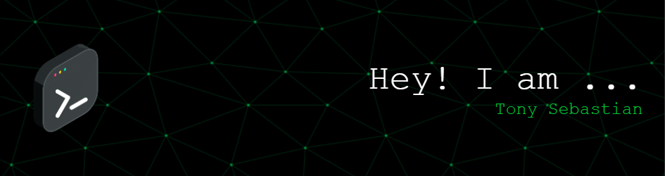

<!--
Tony Sebastian | Full-Stack Developer | AI Automation | Cybersecurity | Open Source | Next.js | Node.js | AI Tools | Kerala | Portfolio | GitHub Profile | OpenSentinel | Automation | Security | Deep Learning | NLP | Prompt Engineering
-->


<p align="center">
  
  
  
  
  
  
  
  
</p>

<p align="center">
  <a href="https://github.com/tonysebastine"></a>
  <a href="https://linkedin.com/in/tonysebastine"></a>
  <a href="https://instagram.com/thb_tz"></a>
</p>

# 👋 Hey, I'm Tony Sebastian (tonysebastine)

**Full‑Stack Web Developer | Cybersecurity Enthusiast | AI‑Powered Maker**

<!-- AI & Dev Tool Logos -->
<p align="center" style="display: flex; flex-wrap: wrap; justify-content: center; gap: 8px;">
  
  
  
  
  
  
  
</p>

---

## 💬 About Me
Self‑taught full‑stack developer and cybersecurity nerd from Kochi, Kerala. I build secure, AI‑driven automation tools and full-stack web solutions. Former Technical Support & Network Engineer with real-world server experience.

---

## 🛠️ Tech Stack

- **Frontend:** HTML, Next.js, Vue.js, Tailwind CSS, Inertia.js  
- **Backend:** Node.js/Express, PHP (Laravel, CodeIgniter)  
- **Databases:** MongoDB Atlas, MySQL  
- **AI & Tools:** Copilot, Gemini, ChatGPT, DeepSeek, Cursor, Bolt, VS Code  
- **Hosting:** cPanel, Plesk, Apache/Nginx, VPS/Dedicated  
- **OS & Shell:** Kali, Debian, Windows, macOS, zsh  
- **Security/Ops:** PHP‑FPM tuning, `top`, OWASP ZAP/Nmap  
- **Experimental:** LilyGO + CC1101 (IoT radio modules for wireless experiments), WhatsApp automation, Malayalam voice‑to‑text

---

## 🚀 Main Project: OpenSentinel
An AI-driven pentesting platform with:
- Hybrid scans (Nmap + ZAP)
- Web UI + CLI
- AI-aided reports (Gemini, ChatGPT, DeepSeek)
- MongoDB & Supabase auth
- Self-hostable dashboard with role-based access

[🔗 OpenSentinel Repository](https://github.com/tonysebastine/OpenSentinel)

---

## 🔎 GitHub Highlights

[](https://git.io/streak-stats)
[](https://github.com/ryo-ma/github-profile-trophy)

<!-- Modern look with theme control. For reliability, consider self-hosting these widgets. -->

---

## ⚙️ CI & Coverage

[](https://github.com/tonysebastine/OpenSentinel/actions)
[](https://github.com/tonysebastine/OpenSentinel/actions)

---

## 🌐 Portfolio & Connect

- **Website:** [thbtz.in](https://thbtz.in)
- **LinkedIn:** [linkedin.com/in/tonysebastine](https://www.linkedin.com/in/tonysebastine)
- **TryHackMe:** [tryhackme.com/p/tonysebastine](https://tryhackme.com/p/tonysebastine)
- **Open to:** Freelance work, collaborations, and mentoring

---

## 📊 Profile & Visitor Stats

[](https://github.com/tonysebastine)
[](https://github.com/tonysebastine)

[](https://github.com/tonysebastine)

---

## 🤖 Fun AI Fact

Did you know?
I regularly experiment with the latest AI models and automation tools, integrating them into real-world security and productivity solutions. My projects often combine AI (like Gemini, ChatGPT, DeepSeek) with custom code to create unique, self-hosted platforms. If you're interested in AI-driven automation, let's connect!

---

## 📬 Contact

Feel free to reach out for freelance work, collaborations, or just to connect!

- Email: tony [at] thbtz [dot] in
- LinkedIn: [linkedin.com/in/tonysebastine](https://www.linkedin.com/in/tonysebastine)

---

### 🏅 Badges & Achievements

[](https://tryhackme.com/p/tonysebastine)

**"Design with purpose. Code clearly. Secure thoughtfully."**

Thanks for stopping by! 👋

<!--
JSON-LD for AI/SEO crawlers
-->
```json
{
  "@context": "https://schema.org",
  "@type": "Person",
  "name": "Tony Sebastian",
  "url": "https://github.com/tonysebastine",
  "sameAs": [
    "https://thbtz.in",
    "https://www.linkedin.com/in/tonysebastine",
    "https://tryhackme.com/p/tonysebastine"
  ],
  "jobTitle": "Full-Stack Web Developer, Cybersecurity Enthusiast",
  "alumniOf": "Self-taught",
  "knowsAbout": [
    "AI Automation",
    "Cybersecurity",
    "Full-Stack Development",
    "Open Source",
    "Prompt Engineering",
    "Node.js",
    "Next.js",
    "Python",
    "Linux",
    "Docker",
    "MongoDB",
    "MySQL",
    "Tailwind",
    "React",
    "TypeScript"
  ],
  "email": "tony@thbz.in"
}
```
